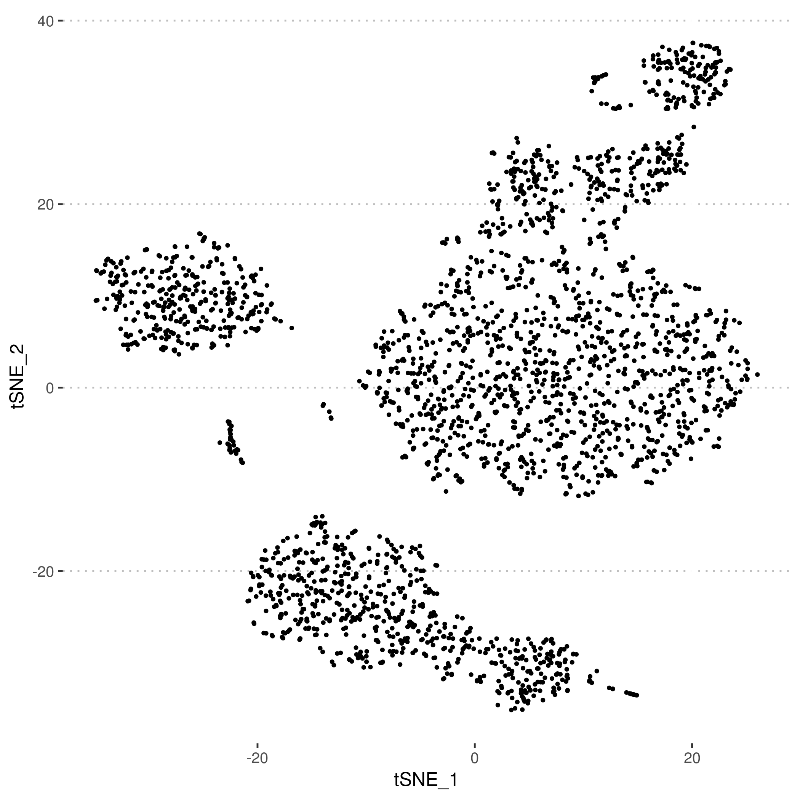
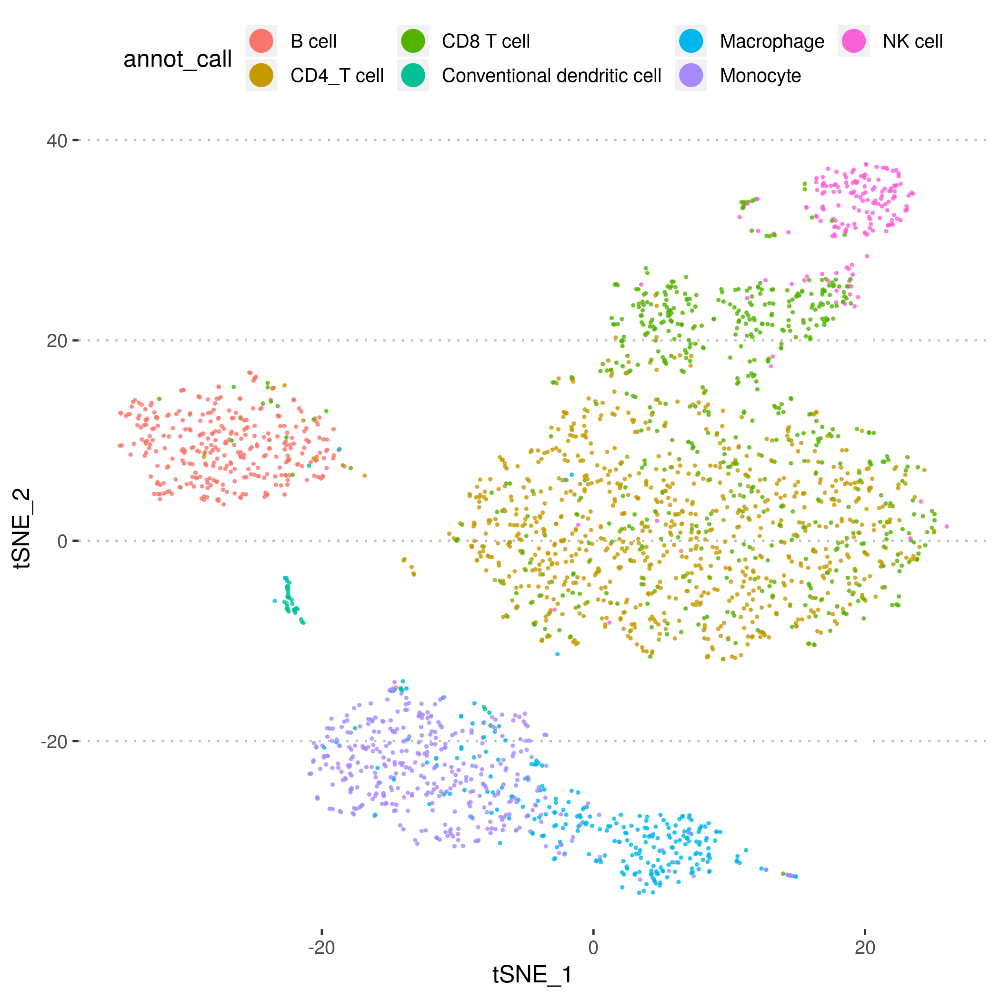
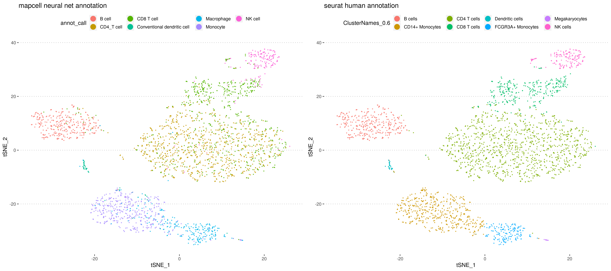

# Deployment of siamese SNN for transferring annotation from one annotated experiment to another

Case Study 2: Annotating seurat object using trained peripheral blood model from microwell
-------------------------------------------------

Source the functions and load the seurat object. Because of the large size, the file is hosted on aws, and will be downloaded when the file is absent.

``` r
# Load Functions
source("./annotation_functions/function_lib_annotation.R")

# Read in External counts data matrix
library(Seurat)

#Download the example  seurat object
destfile="./external_data/seurat_objs/pbmc3k_final_test.rds"
if(!file.exists(destfile)){
  dir.create("./external_data/seurat_objs")
  download.file("https://snn-api-demo-data.s3-ap-southeast-1.amazonaws.com/pbmc3k_final.rds",destfile)
}

# Read in the seurat object
seurat_obj   = readRDS("./external_data/seurat_objs/pbmc3k_final.rds")
```

## Load trained models

``` r
# Load Trained Model to use and the reference data for transfer of annotation
gene_names    = "./models_reference/human_cell_landscape/peri-blood/gene_names.rds" %>% readRDS() 
model_sel     = "./models_reference/human_cell_landscape/peri-blood/weights.h5"     %>% build_embedding(rna_length = length(gene_names),weights_h5 = .)
refCells_sel  = "./models_reference/human_cell_landscape/peri-blood/embed_ref.rds"  %>% readRDS()
metaCells_sel = "./models_reference/human_cell_landscape/peri-blood/meta_ref.rds"   %>% readRDS()
# Access the gene names in the seurate object to find the common ones with those of the pretrained model to be fed into as inputs
common_genes  = seurat_obj@raw.data@Dimnames[[1]] %>% intersect(gene_names)
```

### Perform Annotation in chunks of 1000 cells so that it can be done with little memory requirement

``` r
# Number of selected cells 
sel_cols = 1:ncol(seurat_obj@raw.data)

# Split into chunks of 4000 or less cells
chunks   = split(sel_cols, ceiling(seq_along(sel_cols)/1000)) 

annot_out=list()

for(i in 1:length(chunks)){
  
  # Find the common genes and map those counts over  
  common.mat      =
    apply(seurat_obj@raw.data[,chunks[[i]]],2,function(x){
      api.vec               = rep(0L,length(gene_names))
      names(api.vec)        = gene_names
      api.vec[common_genes] = x[common_genes]
      cell_exp              = as.numeric(api.vec/max(api.vec))
      return(cell_exp)
    })
  rownames(common.mat) = gene_names
  
  annotate_cell.list = annotate_fn_v2(common.mat, 
                                      model_sel,
                                      refCells_sel,
                                      metaCells_sel$Celltype_clean,
                                      neighbors = 21)
  
  annot_out[[i]] = 
    annotate_cell.list  %>% group_by(cell_bc) %>% 
    arrange(-annot_cts) %>% slice(1) %>% ungroup() %>% arrange(annot_cts)

}

```

    ## embedding start
    
    ## annotating

### Collect all annotation results and bind them together

``` r
annot_all = 
  annot_out %>% do.call("rbind",.) %>%
  group_by(cell_bc) %>% top_n(n=1,wt=-knn_dist)

annot_all
```

### Combine with meta-data present in seurat object

``` r
combined_annot.df = seurat_obj@meta.data %>% rownames_to_column("cell_bc") %>% left_join(annot_all)
```

    ## Joining, by = "cell_bc"

### Combine with tSNE coordinates in seurat object & visualize non-annotated results

```{r}
#Append the tsne coords
plot.df = seurat_obj@dr$tsne@cell.embeddings %>% data.frame() %>% rownames_to_column(var="cell_bc") %>% left_join(combined_annot.df)

before.plot =
  plot.df %>% 
  ggplot(aes(x=tSNE_1,y=tSNE_2))+
  geom_point(size=0.7)+
  theme_pubclean()+
  guides(color = guide_legend(override.aes = list(size=5,alpha=1)))

before.plot %>% ggsave(plot = .,filename = "./plots/seurat_tsne.png")
before.plot
```



### Visualize MapCell Annotations

```{r}
# Plot the annotated data as colors
after.plot =
  plot.df %>% 
  ggplot(aes(x=tSNE_1,y=tSNE_2,color=annot_call))+
  geom_point(size=0.4,alpha=0.7)+
  theme_pubclean()+
  guides(color = guide_legend(override.aes = list(size=5,alpha=1)))+
  ggtitle("mapcell neural net annotation")

after.plot %>% ggsave(plot = .,filename = "./plots/seurat_annot.png")
```



### Compare MapCell annotations with seurat human annotations

```{r}
human.plot =
  plot.df %>% 
  ggplot(aes(x=tSNE_1,y=tSNE_2,color=ClusterNames_0.6))+
  geom_point(size=0.4,alpha=0.7)+
  theme_pubclean()+
  guides(color = guide_legend(override.aes = list(size=5,alpha=1)))+
  ggtitle("seurat human annotation")
compare.plot = ggarrange(after.plot,human.plot,ncol=2)
compare.plot %>% ggsave("./plots/seurat_compare.png",.,width = 18,height = 8)
compare.plot
```

